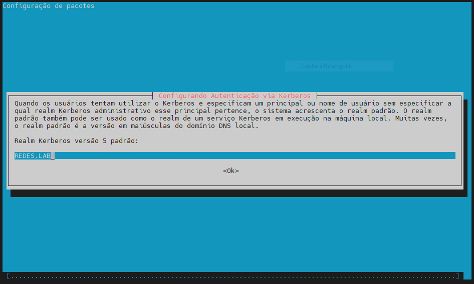
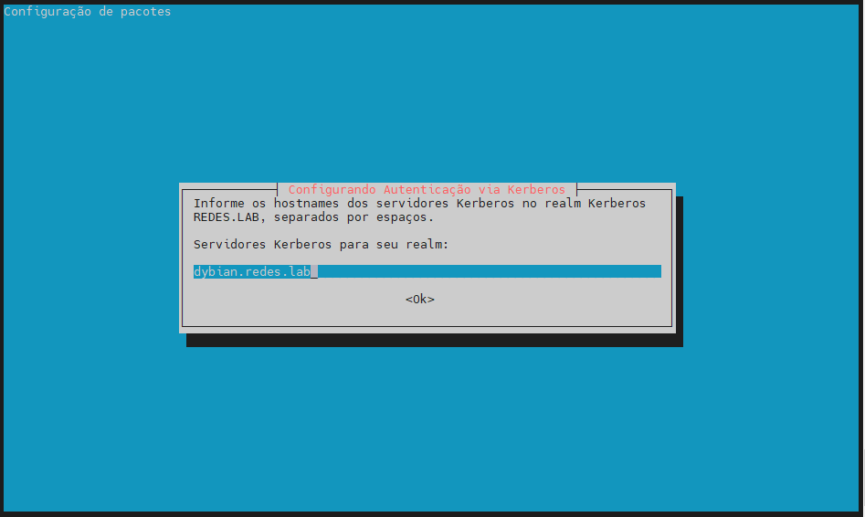

# Pacotes

Para transformar seu servidor em um Controlador de Domínio Active Directory, instale o Samba e todos os pacotes necessários em sua máquina com privilégios de *root* em um console.

Pacotes:

- [samba](https://packages.debian.org/bullseye/samba)
- [krb5-user](https://packages.debian.org/bullseye/krb5-user)
- [krb5-config](https://packages.debian.org/bullseye/krb5-config)
- [winbind](https://packages.debian.org/bullseye/winbind)
- [libpam-winbind](https://packages.debian.org/bullseye/libpam-winbind)
- [libnss-winbind](https://packages.debian.org/bullseye/libnss-winbind)

Comando:

- `apt install -y samba krb5-user krb5-config winbind libpam-winbind libnss-winbind`

Enquanto a instalação estiver em execução, uma série de perguntas serão feitas pelo instalador para configurar o controlador de domínio.

Na primeira tela, você precisará adicionar um nome para o reino padrão do Kerberos (*Kerberos REALM*) em letras maiúsculas. Digite o nome que você usará para o seu domínio em letras maiúsculas e pressione Enter para continuar.

Em seguida, digite o nome do host do servidor Kerberos para seu domínio. Use o mesmo nome do seu domínio, desta vez com letras minúsculas e pressione Enter para continuar.

Por fim, especifique o nome do host para o servidor administrativo de seu domínio Kerberos . Use o mesmo que seu domínio e pressione Enter para finalizar a instalação.

